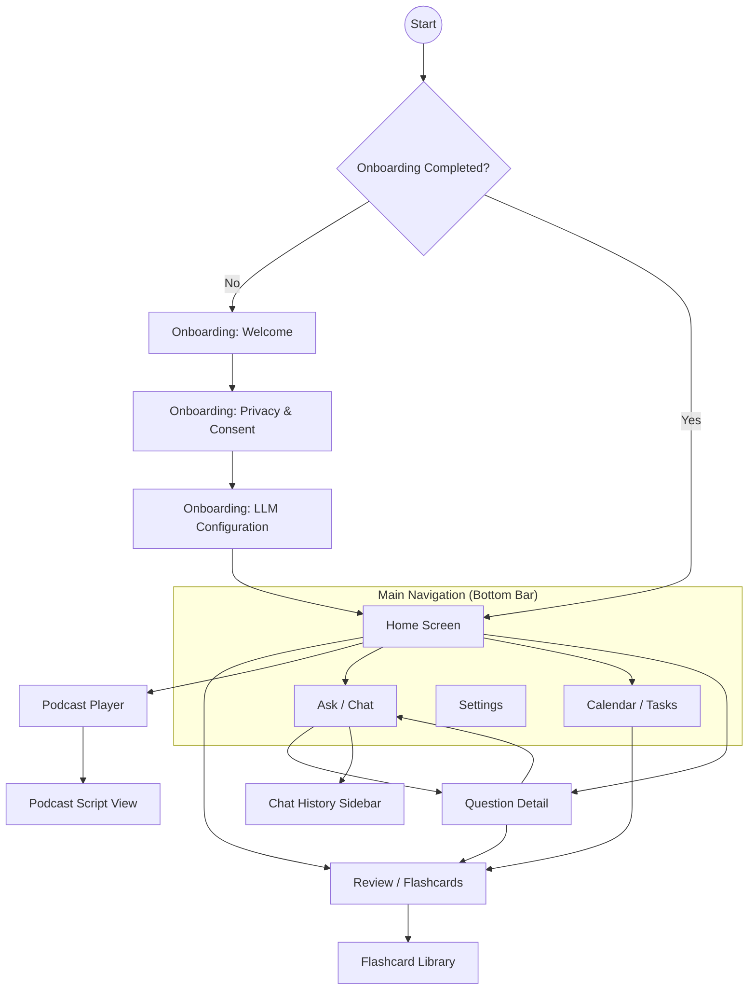

# EchoLearn Screen Design & User Flow

This document details the current screen designs, interactions, and user flows for the EchoLearn React application.

## User Flow Tree Map



---

## Screen Designs (Wire Charts)

### 1. Home Screen
The primary dashboard providing a summary of today's learning and quick access to core features.

```text
+---------------------------------------+
| Good Morning, User!             [ ]   |
| Tuesday, March 17               Logo  |
+---------------------------------------+
| Today's Summary                       |
| [Brain Icon]        12 Questions Today|
|                                       |
| [ 15 Due ]         [ 8 Tasks ]        |
+---------------------------------------+
| +-----------------+ +-----------------+ |
| | Review          | | Tasks           | |
| | [Book Icon]     | | [Check Icon]    | |
| | 15 Due          | | 8 Pending       | |
| +-----------------+ +-----------------+ |
+---------------------------------------+
| Today's Podcast                       |
| [Headphones] Ready · 10 min   [Ready] |
+---------------------------------------+
| Recent Questions                      |
| > What is spaced repetition?          |
| > Explain the Feynman technique...    |
+---------------------------------------+
|                                  (Mic)| <--- Floating Action Button
+---------------------------------------+
| [Home]    [Ask]    [Calendar] [Settings]|
+---------------------------------------+
```

### 2. Ask (Chat) Screen
AI-powered learning assistant with streaming responses and history management.

```text
+---------------------------------------+
| Ask                   [History] [+]New|
| Your AI learning companion            |
+---------------------------------------+
| [AI]: Hi! I'm your AI learning        |
| companion. Ask me anything...         |
|                                       |
| Try asking:                           |
| [ Prompt: What is spaced repetition? ]|
| [ Prompt: Explain Feynman technique  ]|
|                                       |
| [User]: How does memory work?         |
|                                       |
| [AI]: Memory is the process of...     |
| [Edit] [Regenerate] [Flag]            |
+---------------------------------------+
| [ Type your question here...      (>)] |
+---------------------------------------+
| [Home]    [Ask]    [Calendar] [Settings]|
+---------------------------------------+
```

### 3. Calendar Screen
Daily schedule management with time blocks and nested todos.

```text
+---------------------------------------+
| Calendar                         (+)  |
| 3 of 8 tasks done                     |
+---------------------------------------+
|  <    Tuesday, March 17     >         |
|        [Back to Today]                |
+---------------------------------------+
| [========ProgressBar 37%========]     |
+---------------------------------------+
| +-----------------------------------+ |
| | Morning Deep Work        [Pin][Del] |
| | 09:00 - 11:00                       |
| | [x] Read about React Query          |
| | [ ] Finish implementation      [->] |
| | [ + Add task...               (+) ] |
| +-----------------------------------+ |
| +-----------------------------------+ |
| | Afternoon Review         [Pin][Del] |
| | 14:00 - 15:00                       |
| | [ ] Review flashcards               |
| +-----------------------------------+ |
+---------------------------------------+
| [Home]    [Ask]    [Calendar] [Settings]|
+---------------------------------------+
```

### 4. Review Screen
Spaced repetition flashcard session.

```text
+---------------------------------------+
| [<-] Back             12 / 15 Reviewed|
+---------------------------------------+
| [========ProgressBar 80%========]     |
+---------------------------------------+
| +-----------------------------------+ |
| |                                   | |
| |             FRONT                 | |
| |      (Question/Concept)           | |
| |                                   | |
| |          [ Tap to flip ]          | |
| |                                   | |
| +-----------------------------------+ |
|                                       |
| [ 1 ]  [ 2 ]  [ 3 ]  [ 4 ]  [ 5 ]     |
| Again  Hard   Good   Easy   Perfect   |
+---------------------------------------+
|            [ Skip for now ]           |
+---------------------------------------+
```

### 5. Podcast Screen
Audio summaries of knowledge generated via TTS.

```text
+---------------------------------------+
| [<-] Podcasts                         |
| Your daily learning summaries         |
+---------------------------------------+
| +-----------------------------------+ |
| | Today Recap        (Radio Icon)   | |
| | 08:30 min                         | |
| | [========ProgressBar 45%========] | |
| |                                   | |
| |   ( -10 )    ( PLAY )    ( +10 )  | |
| |                                   | |
| | +-------------------------------+ | |
| | | Script Preview              > | | |
| | | Memory is a complex...        | | |
| | +-------------------------------+ | |
| +-----------------------------------+ |
+---------------------------------------+
| All Podcasts                          |
| [ Today Recap        [Ready] [Del] ]  |
| [ March 16 Recap     [Ready] [Del] ]  |
+---------------------------------------+
```

### 6. Settings Screen
Full configuration for AI providers, TTS, and app preferences.

```text
+---------------------------------------+
| Settings                              |
| Configure your EchoLearn experience   |
+---------------------------------------+
| [Brain] Language Model                |
| Provider: [ OpenAI              (V) ] |
| API Key:  [ ****************        ] |
| Model:    [ gpt-4o              (V) ] |
| [ Save ] [ Test Connection ]          |
+---------------------------------------+
| [Volume] Text-to-Speech               |
| Provider: [ OpenAI TTS          (V) ] |
| Voice:    [ Alloy               (V) ] |
+---------------------------------------+
| [Shield] Privacy & Data               |
| AI Transmission:       (o====) [ON]   |
| [ Export Data ] [ Import Data ]       |
+---------------------------------------+
| [Palette] Appearance                  |
| Theme:    [ System              (V) ] |
+---------------------------------------+
|          [ Reset to Defaults ]        |
+---------------------------------------+
```

---

## Interactions & User Flow Detailed Explanation

### 1. Onboarding Flow
- **First Launch**: Users are greeted with a welcome screen explaining core features.
- **Privacy & Consent**: Transparent explanation of local-first data storage and how AI requests work. Users must explicitly consent to AI data transmission.
- **LLM Setup**: Users configure their AI provider (OpenAI, Claude, Gemini, or Local). API keys are stored locally.

### 2. Knowledge Acquisition (Ask)
- **Chatting**: Users can type or use voice (STT) to ask questions.
- **Streaming**: AI responses stream in real-time.
- **Contextual Knowledge**: AI identifies related concepts already in the user's knowledge base.
- **Session Management**: Conversations are grouped into sessions, visible in the history sidebar.

### 3. Knowledge Retention (Review)
- **Spaced Repetition**: Questions asked in the chat are automatically converted into flashcards.
- **Daily Queue**: A daily review queue is generated based on SRS algorithms.
- **Rating**: Users rate their recall on a 1-5 scale, which adjusts the next review interval.
- **Library**: Users can view and manage all their cards, pinning important ones for daily review.

### 4. Daily Organization (Calendar)
- **Time Blocking**: Users organize their day into blocks (e.g., "Morning Learning").
- **Task Integration**: Specific tasks (todos) are added to these blocks.
- **Persistence**: Blocks and tasks can be pinned to repeat every day.

### 5. Multi-modal Learning (Podcast)
- **Recap Generation**: At a scheduled time (or manually), the app generates a script summarizing recent learning.
- **TTS Conversion**: The script is converted to audio using configured TTS providers.
- **Playback**: Users can listen to their summaries on the go, with full playback controls and script viewing.

### 6. Privacy & Offline First
- **Local Storage**: All application data (except AI requests) stays on the device.
- **Local LLMs**: Support for Ollama and LM Studio allows for a completely offline AI experience.
- **ZeroTier**: Integration for connecting to local AI servers over a virtual LAN.
